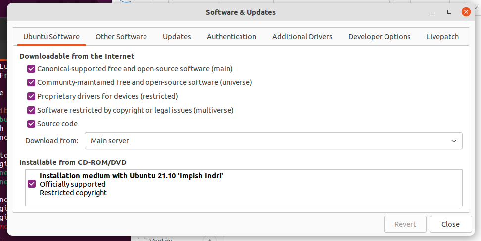
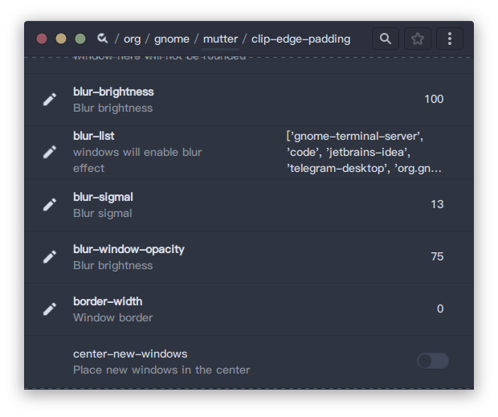
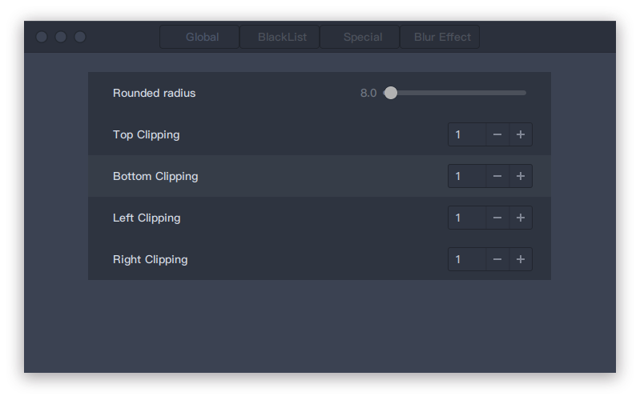

Tested in gnome-shell 40.5, should works in gnome 40 and 41.

integrate the blur effects with rounded corners.The source code can be found [here](https://github.com/yilozt/mutter).

__Issues__:

- It can be buggy with blur effect. see [https://github.com/aunetx/blur-my-shell](https://github.com/aunetx/blur-my-shell). If you are using intel driver in Xorg session, try create `.drirc` in your home directory to disable Vertical Synchronization: 
  ```
  <device screen="0" driver="dri2">
      <application name="Default">
          <option name="vblank_mode" value="0"/>
      </application>
  </device>
  ```

- The original shadows of rounded windows has been cutted out, now use `MetaShadowFactroy` to draw shadows for rounded windows. So the animation effect of shadows in some themes has gone. 

# Install

## Arch Linux

install `mutter-rounded` by AUR helper:

```
yay -S mutter-rounded
```

## Ubuntu 21.10

There is a simple script to help you build the packages in ubuntu 21.10. It's neccesary to check the content of script. Before you build the packages, the `Source code` checkbox in `Software & Updates` should be enabled:



```
git clone https://github.com/yilozt/mutter-rounded
cd ./mutter-rounded/ubuntu_21.10
./package.sh
sudo dpkg -i *.deb
```

# Screenshots


# Settings

The settings of mutter have driven by GSettings, so you can set config by:

- via `gsettings`:
  ```
  $ gsettings get org.gnome.mutter round-corners-radius 
  14
  $ gsettings set org.gnome.mutter round-corners-radius 8
  ```

- via `dconf-editor`, the settings are located in `/org/gnome/mutter`:
  

- via [mutter_setting](https://gitlab.gnome.org/lluo/mutter-rounded-setting), a simple gui written by Gjs.
  
